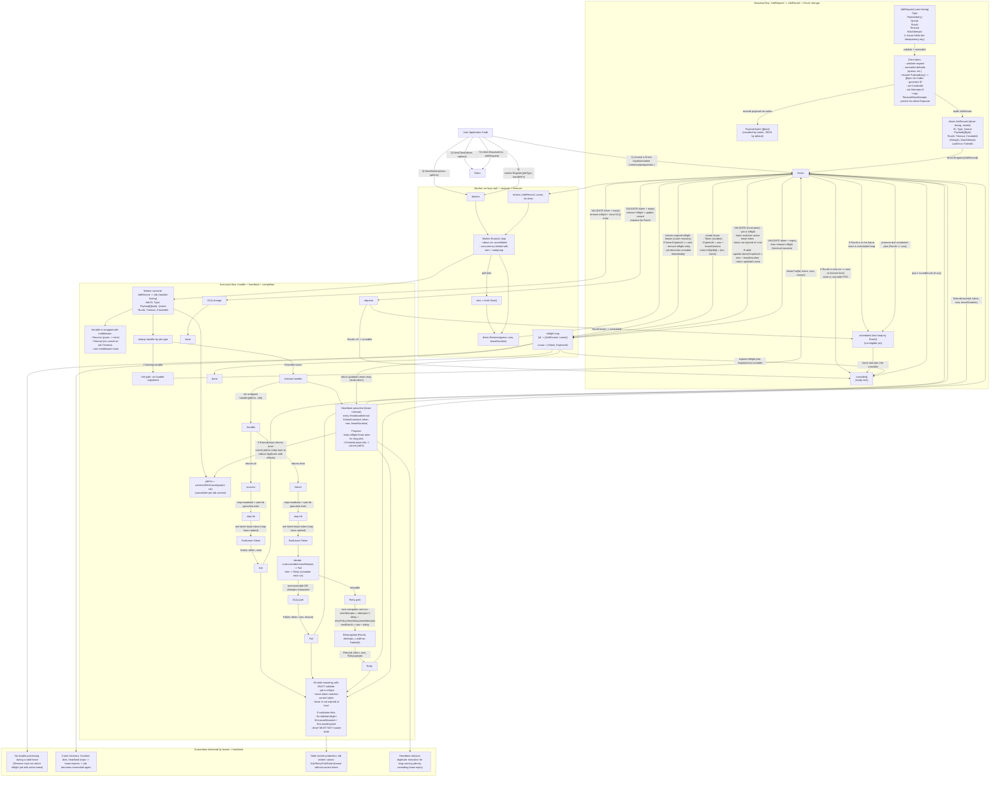

```mermaid
flowchart TD

  %% =========================================================
  %% ACTORS / MAIN COMPONENTS
  %% =========================================================
  U[User Application Code]
  C[Client]
  W[Worker]
  D[Driver]
  H[Handler]


  %% =========================================================
  %% USER SETUP
  %% =========================================================
  U -->|"1) choose a Driver implementation (memory/postgres/etc.)"| D
  U -->|"2) NewClient(driver, options)"| C
  U -->|"3) NewWorker(driver, options)"| W
  U -->|"4) worker.Register(jobType, handlerFn)"| W


  %% =========================================================
  %% ENQUEUE PATH: USER -> CLIENT -> DRIVER STORAGE
  %% =========================================================
  U -->|"5) client.Enqueue(ctx, JobRequest)"| C

  subgraph ENQ[Enqueue flow: JobRequest -> JobRecord -> Driver storage]
    direction TB

    JR["JobRequest (user-facing)<br/>Type<br/>Payload(any)<br/>Queue<br/>RunAt<br/>Timeout<br/>MaxAttempts<br/>(+ future fields like idempotency key)"]

    C1["Client does:<br/>- validate request<br/>- normalize defaults (queue, etc.)<br/>- encode Payload(any) -> []byte via Codec<br/>- generate ID<br/>- set CreatedAt<br/>- set Attempts=0<br/>- copy Timeout/MaxAttempts<br/>- persist via driver.Enqueue"]

    PAY["Payload bytes ([]byte)<br/>(encoded by codec, JSON by default)"]

    JREC["driver.JobRecord (driver-facing, stored)<br/>ID, Type, Queue<br/>Payload([]byte)<br/>RunAt, Timeout, CreatedAt<br/>Attempts, MaxAttempts<br/>LastError, FailedAt"]

    JR -->|"validate + normalize"| C1
    C1 -->|"encode payload via codec"| PAY
    C1 -->|"build JobRecord"| JREC
    JREC -->|"driver.Enqueue(JobRecord)"| D

    D -->|"if RunAt is zero (or <= now at reserve time)<br/>store in runnable FIFO"| RUNQ["runnable[]<br/>(ready now)"]
    D -->|"if RunAt is in the future<br/>store in scheduled heap"| SCHQ["scheduled (min-heap by RunAt)<br/>(not eligible yet)"]
  end


  %% =========================================================
  %% WORKER LOOP: RESERVE WITH LEASES + RECLAIM + PROMOTION
  %% =========================================================
  subgraph LOOP[Worker run loop: poll -> reserve -> execute]
    direction TB

    WLOOP["Worker.Run(ctx) loop<br/>- obeys ctx cancellation<br/>- concurrency-limited with sem + waitgroup"]
    W --> WLOOP

    NOW["now = clock.Now()"]
    WLOOP -->|"poll time"| NOW

    RES["driver.Reserve(queue, now, leaseDuration)"]
    NOW --> RES
    WLOOP --> RES
    RES --> D

    D -->|"promote due scheduled jobs (RunAt <= now)"| SCHQ
    SCHQ -->|"move due jobs into runnable"| RUNQ

    INFL["inflight map<br/>(id -> {JobRecord, Lease})<br/><br/>Lease = {Token, ExpiresAt}"]

    D -->|"reclaim expired inflight leases (crash recovery)<br/>if lease.ExpiresAt <= now:<br/>- remove inflight entry<br/>- job becomes runnable immediately"| INFL
    INFL -->|"expired inflight jobs requeued as runnable"| RUNQ

    D -->|"pop 1 runnable job (if any)"| RUNQ
    D -->|"create lease:<br/>- Token (random)<br/>- ExpiresAt = now + leaseDuration<br/>store inflight[id] = {rec, lease}"| INFL

    RET["returns (JobRecord, Lease, ok=true)"]
    D --> RET
    RET --> WLOOP
  end


  %% =========================================================
  %% EXECUTION: JOBRECORD -> JOB, MIDDLEWARE, HEARTBEAT
  %% =========================================================
  subgraph EXEC[Execution flow: handler + heartbeat + completion]
    direction TB

    CONV["Worker converts JobRecord -> Job (handler-facing)<br/>Job.ID, Type, Payload([]byte), Queue<br/>RunAt, Timeout, CreatedAt"]
    WLOOP --> CONV

    CTX["jobCtx = context.WithCancel(parent ctx)<br/>(cancelable per-job context)"]
    CONV --> CTX

    MW["Handler is wrapped with middleware:<br/>- Recover (panic -> error)<br/>- Timeout (ctx cancel on job.Timeout)<br/>- user middleware chain"]
    CONV --> MW

    LOOKUP["lookup handler by job type"]
    CONV --> LOOKUP

    LOOKUP -->|"if missing handler"| NOH["Fail path: no handler registered"]
    LOOKUP -->|"if handler exists"| HAS["execute handler"]

    HB["Heartbeat goroutine (lease renewal)<br/>every HeartbeatInterval:<br/>ExtendLease(id, token, now, leaseDuration)<br/><br/>Purpose:<br/>- keep inflight lease alive for long jobs<br/>- if ExtendLease fails -> cancel jobCtx"]
    HAS --> HB

    HAS -->|"run wrapped handler(jobCtx, Job)"| H


    HB -->|"ExtendLease(id, token, now, leaseDuration)"| D
    D -->|"VALIDATE (must pass):<br/>- job is inflight<br/>- token matches active lease token<br/>- lease not expired at 'now'<br/><br/>If valid:<br/>- update stored ExpiresAt = now + leaseDuration<br/>- return updated Lease"| INFL
    INFL -->|"return updated Lease (may rotate token)"| HB

    HB -->|"if ExtendLease returns error:<br/>cancel jobCtx (stop work to reduce duplicate side effects)"| CTX

    NOH -->|"driver.Fail(id, token, now, reason)"| D


    H -->|"returns nil"| OK[success]
    H -->|"returns error"| ERR[failure]


    OK -->|"stop heartbeat + wait hb goroutine exits"| STOPHB1["stop hb"]
    ERR -->|"stop heartbeat + wait hb goroutine exits"| STOPHB2["stop hb"]

    STOPHB1 -->|"use latest lease token (may have rotated)"| TOK1["finalLease.Token"]
    STOPHB2 -->|"use latest lease token (may have rotated)"| TOK2["finalLease.Token"]


    VALIDNOTE["All state-mutating calls MUST validate:<br/>- job is inflight<br/>- lease token matches current token<br/>- lease is not expired at 'now'<br/><br/>If validation fails:<br/>- ErrJobNotInflight / ErrLeaseMismatch / ErrLeaseExpired<br/>- driver MUST NOT mutate state"]


    TOK1 -->|"Ack(id, token, now)"| ACK["Ack"]
    ACK --> D
    D -->|"VALIDATE token + expiry<br/>then remove inflight (terminal success)"| INFL
    INFL --> DONE1[done]


    TOK2 --> DECIDE["decide: unrecoverable/maxAttempts -> Fail<br/>else -> Retry (schedule next run)"]
    DECIDE -->|"unrecoverable OR attempts exhausted"| FAILP[DLQ path]
    DECIDE -->|"retryable"| RETRYP[Retry path]


    FAILP -->|"Fail(id, token, now, reason)"| FAILCALL["Fail"]
    FAILCALL --> D
    D -->|"VALIDATE token + expiry<br/>remove inflight + store DLQ entry"| DLQ["DLQ storage"]
    DLQ --> DONE2[done]


    RETRYP -->|"core computes next run:<br/>nextAttempts = attempts+1<br/>delay = retryPolicy.NextDelay(nextAttempts)<br/>nextRunAt = now + delay"| BACKOFF["RetryUpdate {RunAt, Attempts, LastError, FailedAt}"]
    BACKOFF -->|"Retry(id, token, now, RetryUpdate)"| RETRYCALL["Retry"]
    RETRYCALL --> D
    D -->|"VALIDATE token + expiry<br/>remove inflight + update record<br/>requeue by RunAt"| REQUEUE["requeue"]
    REQUEUE -->|"RunAt==0 -> runnable"| RUNQ
    REQUEUE -->|"RunAt future -> scheduled"| SCHQ


    ACK --> VALIDNOTE
    FAILCALL --> VALIDNOTE
    RETRYCALL --> VALIDNOTE
    HB --> VALIDNOTE
  end


  %% =========================================================
  %% GUARANTEES (CALL OUTS)
  %% =========================================================
  subgraph NOTES[Guarantees delivered by leases + heartbeat]
    direction TB
    G1["No double processing during a valid lease<br/>(Reserve must not return inflight job with active lease)"]
    G2["Crash recovery: if worker dies, heartbeat stops -> lease expires -> job becomes reservable again"]
    G3["Stale worker protection: old worker cannot Ack/Retry/Fail/ExtendLease without correct token"]
    G4["Heartbeat reduces duplicate execution for long-running jobs by extending lease expiry"]
  end

  INFL --> G1
  INFL --> G2
  VALIDNOTE --> G3
  HB --> G4

```
